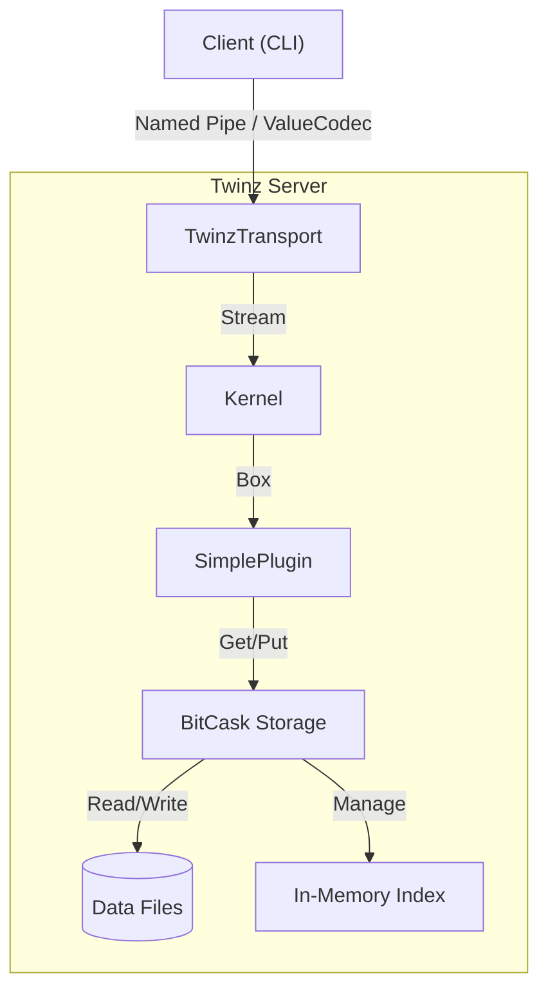

# Twinz

> A high-performance distributed Key-Value store written in Rust.

**Twinz** is a microkernel-based KV server featuring a pluggable architecture, legacy-compatible BitCask storage, and a dynamic "Duck Typing" protocol. designed to be modular, fast, and easy to extend.

## 🚀 Features

- **BitCask Storage**: Log-structured, persistent key-value storage with O(1) read latency (in-memory KeyDir).
- **Transport Agnostic**: Built on `async-trait`, currently supporting efficient **Windows Named Pipes** (Unix Domain Sockets on Linux/macOS supported).
- **Dynamic Typing**: Native support for complex data types (Arrays, Maps) via `ValueCodec`, enabling JSON-like interactions instead of raw bytes.
- **Microkernel Architecture**: The core is minimal; functionality is extended via Plugins.
- **Compaction**: Supports manual or background garbage collection (Compaction) to reclaim disk space.

## 🛠️ Getting Started

### Prerequisites

- Rust (latest stable)

### Installation

```bash
git clone https://github.com/Akanyi/Twinz.git
cd Twinz
cargo build --release
```

### Usage

#### 1. Start Server

Run the server with a specific sync strategy:

```bash
# Start with OS-managed sync (Fastest, relies on OS cache)
cargo run --bin twinz -- server --name twinz_default --sync-mode os

# Start with Interval sync (Safer, flushes every N seconds)
cargo run --bin twinz -- server --name twinz_default --sync-mode interval --sync-interval 5

# Start with Always sync (Safest, Slowest)
cargo run --bin twinz -- server --name twinz_default --sync-mode always
```

#### 2. Client Demo

The built-in client demonstrates the **Duck Typing** capabilities by sending structured commands (`["SET", key, value]`):

```bash
cargo run --bin twinz -- client --name twinz_default
```

#### 3. Storage Compaction

Merge old data files to save space:

```bash
cargo run --bin twinz -- Compact --storage-dir ./data
```

## 🧩 Architecture



## 🗺️ Roadmap

- [x] **Core**: Kernel, Transport, and Duck Typing System.
- [x] **Storage**: BitCask Engine with Sync & Compaction.
- [ ] **Plugin System**: Dynamic loading of native plugins (DLL).
- [ ] **Scripting**: WASM runtime integration.

## 📄 License

Apache-2.0
