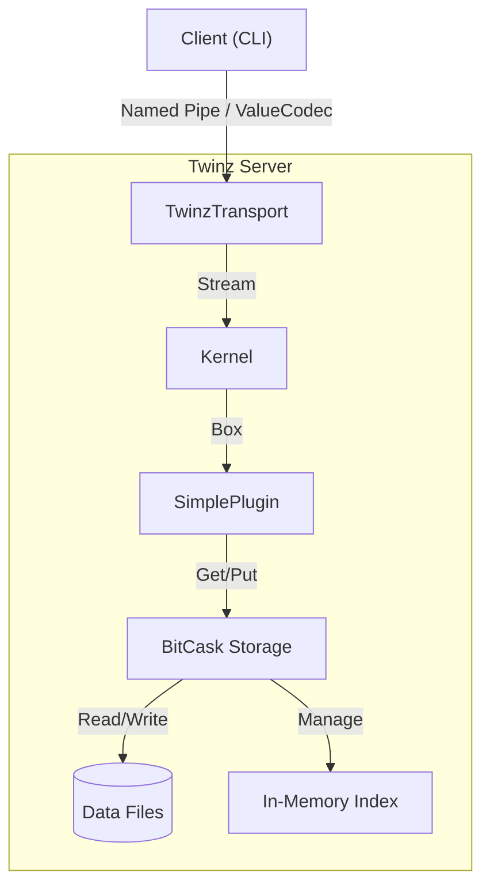

# Twinz 

> A high-performance distributed Key-Value store written in Rust.

English | [中文](https://github.com/Akanyi/Twinz/blob/main/docs/README-zh.md)

**Twinz** is a microkernel-based KV server featuring a pluggable architecture, legacy-compatible BitCask storage, and a dynamic "Duck Typing" protocol. designed to be modular, fast, and easy to extend.

## 🚀 Features

- **BitCask Storage**: Log-structured, persistent key-value storage with O(1) read latency.
- **Transport Agnostic**: Platform-agnostic (Named Pipes on Windows, UDS on Unix).
- **Dynamic Typing**: JSON-like protocol (`ValueCodec`) supporting complex data types.
- **Microkernel Architecture**:
  - **Built-in KV**: Native, high-performance Key-Value logic.
  - **Wasm Plugins**: Sandboxed execution via `wasmtime` with Host Function access (`db_put`).
- **Compaction**: Supports manual or background garbage collection.

## 🛠️ Getting Started

### Prerequisites

- Rust (latest stable)

### Installation

```bash
git clone https://github.com/Akanyi/Twinz.git
cd Twinz
cargo build --release
```

### Usage

#### 1. Start Server

Run the server with a specific sync strategy:

```bash
# Start with OS-managed sync (Fastest, relies on OS cache)
cargo run --bin twinz -- server --name twinz_default --sync-mode os

# Start with Interval sync (Safer, flushes every N seconds)
cargo run --bin twinz -- server --name twinz_default --sync-mode interval --sync-interval 5

# Start with Always sync (Safest, Slowest)
cargo run --bin twinz -- server --name twinz_default --sync-mode always
```

#### 2. Client Demo (Interactive REPL)

Connect to the server and enter the interactive command loop:

```bash
twinz client --name twinz_default
```

Once connected, you can type commands:

```text
twinz> SET mykey "Hello World"
Response: String("OK")
twinz> GET mykey
Response: String("Hello World")
twinz> EXIT
```

#### 3. Storage Compaction

Merge old data files to save space:

```bash
cargo run --bin twinz -- Compact --storage-dir ./data
```

## 🧩 Architecture



## 🗺️ Roadmap

- [x] **Core**: Kernel, Transport, and Duck Typing System.
- [x] **Storage**: BitCask Engine with Sync & Compaction.
- [x] **Plugin System**:
  - [x] Native Built-in KV Plugin.
  - [x] WASM Runtime Integration (`wasmtime` + WASI).
- [ ] **SDK**: Client SDK for Rust/Python.

## 📄 License

Apache-2.0
