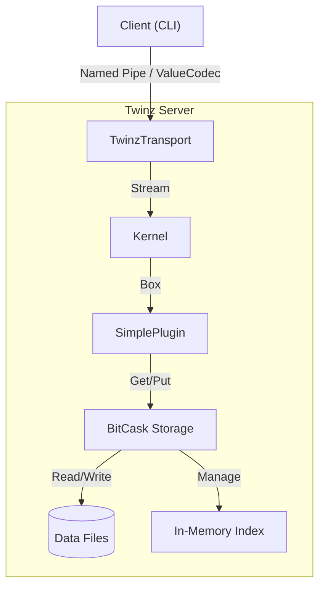

# Twinz 

> 一个使用 Rust 编写的高性能分布式 Key-Value 存储系统。

[English](https://github.com/Akanyi/Twinz) | 中文

**Twinz** 是一个基于微内核的 KV 服务器，具备可插拔架构、兼容 BitCask 的存储引擎，以及动态“鸭子类型”协议。整体设计强调模块化、高性能与易扩展。

## 🚀 特性

- **BitCask 存储**：日志结构化持久化存储，读延迟接近 O(1)。
- **传输层无关**：平台无关（Windows 使用 Named Pipe，Unix 使用 UDS）。
- **动态类型协议**：JSON 风格的 `ValueCodec` 支持复杂类型。
- **微内核架构**：
  - **内置 KV**：原生高性能 Key-Value 逻辑。
  - **Wasm 插件**：基于 `wasmtime` 沙箱执行，支持 Host Function（如 `db_put`）。
- **数据压缩**：支持手动或后台 GC/Compaction。

## 🛠️ 快速开始

### 依赖

- Rust（最新稳定版）

### 安装

```bash
git clone https://github.com/Akanyi/Twinz.git
cd Twinz
cargo build --release
```

### 使用

#### 1. 启动服务端

指定同步策略启动服务端：

```bash
# OS-managed sync（最快，依赖系统缓存）
cargo run --bin twinz -- server --name twinz_default --sync-mode os

# Interval sync（更安全，每 N 秒刷盘）
cargo run --bin twinz -- server --name twinz_default --sync-mode interval --sync-interval 5

# Always sync（最安全，最慢）
cargo run --bin twinz -- server --name twinz_default --sync-mode always
```

#### 2. 客户端交互（REPL）

连接服务端并进入交互式命令行：

```bash
twinz client --name twinz_default
```

示例：

```text
twinz> SET mykey "Hello World"
Response: String("OK")
twinz> GET mykey
Response: String("Hello World")
twinz> EXIT
```

#### 3. 存储压缩

合并旧数据文件以节省空间：

```bash
cargo run --bin twinz -- Compact --storage-dir ./data
```

## 🧩 架构



## 🗺️ Roadmap

- [x] **核心**：Kernel、Transport 与 Duck Typing 系统。
- [x] **存储**：BitCask 引擎，支持 Sync 与 Compaction。
- [x] **插件系统**：
  - [x] 原生内置 KV 插件。
  - [x] WASM 运行时集成（`wasmtime` + WASI）。
- [ ] **SDK**：面向 Rust/Python 的 Client SDK。

## 📄 许可证

Apache-2.0
